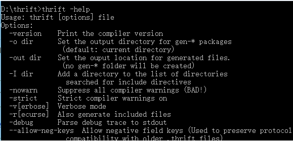

# thrift总结
### 1. 介绍
简单来说，thrift是Facebook公布的一款开源跨语言的RPC框架，那么问题来了
#### 1.1 什么是RPC框架
RPC全称Remote Procedure Call，意为远程过程调用。
假设有两台服务器A、B，A服务器上部署着一个应用a，B服务器上部署着一个应用b，现在a希望能够调用b应用的某个函数（方法），但是二者不在同一个进程内，不能直接调用，就需要通过网络传输，在AB服务器之间建一条网络传输通道，a把参数传过去，b接收到参数调用自己的方法，得到结果，在通过网络传回给a。简单讲，就是A通过网络来调用B的过程涉及的东西很多，比如多线程，Socket，序列化反序列化，网络I/O等，于是牛掰的程序员把这些封装起来做成一套框架，供大家使用，就是RPC框架。
#### 1.2 thrift语言特性
Thrift是一款由Facebook开发的可伸缩、跨语言的服务开发框架，该框架已经开源并且加入了Apache项目。Thrift主要功能是：通过自定义的Interface Definition Language（IDL），可以创建基于RPC的客户端和服务端的服务代码。数据和服务代码的生成是通过Thrift内置的代码生成器来实现的。通过特殊的编译器可以生成不同语言的代码，以满足不同需要的开发者，比如java开发者，就可以生成java代码，C++开发者可以生成C++代码，生成的代码不但包含目标的接口定义、方法、数据类型，还包含有RPC协议层和传输层的实现代码。
### 2. windows下安装配置
Thrift不需要安装，只需下载windows版的Thrift代码生成器即可。
* 下载地址：[http://archive.apache.org/dist/thrift/0.9.3/](http://archive.apache.org/dist/thrift/0.9.3/)
 


注意：下载下来之后，必须把文件名字thrift-0.10.0.exe 改为  thrift.exe, 否则cmd会提示：thrift 不是内部命令的错误。
### 3. Java实例
#### 3.1 编写IDL接口  
login.thrift  
```
namespace java com.lei.thrift  
  
struct Request {  
    1: string username;        
    2: string password;             
}  
  
exception RequestException {  
    1: required i32 code;  
    2: optional string reason;  
}  
  
// 服务名  
service LoginService {  
    string doAction(1: Request request) throws (1:RequestException qe); // 可能抛出异常。  
} 
```
#### 3.2 用Thrift编译器编译成对应的类
运行如下命令，生成对应的java类
```
thrift -gen java login.thrift
```
生成LoginService.java、Request.java、RequestException.java

#### 3.3 编写真正的业务实现类
```
package com.lei.login;

import com.lei.thrift.LoginService;
import com.lei.thrift.Request;
import com.lei.thrift.RequestException;
import org.apache.thrift.TException;

public class LoginServiceImpl implements LoginService.Iface{

    @Override
    public String doAction(Request request) throws RequestException, TException {
        System.out.println("username: " + request.getUsername());
        System.out.println("password: " + request.getPassword());
        return "success";
    }
}
```
#### 3.4 编写Server端代码
```
package com.lei.login;

import com.lei.thrift.LoginService;
import org.apache.thrift.server.TServer;
import org.apache.thrift.server.TSimpleServer;
import org.apache.thrift.transport.TServerSocket;

import java.net.ServerSocket;

public class LoginMain {
    public static void main(String[] args) throws Exception {
        ServerSocket socket = new ServerSocket(8888);
        TServerSocket serverTransport = new TServerSocket(socket);
        LoginService.Processor processor = new LoginService.Processor(new LoginServiceImpl());

        TServer.Args tServerArgs = new TServer.Args(serverTransport);
        tServerArgs.processor(processor);
        TServer server = new TSimpleServer(tServerArgs);
        System.out.println("Starting the simple server");
        server.serve();
    }
}
```
#### 3.5 编写client端代码
```
package com.lei.login;

import com.lei.thrift.LoginService;
import com.lei.thrift.Request;
import org.apache.thrift.protocol.TBinaryProtocol;
import org.apache.thrift.protocol.TProtocol;
import org.apache.thrift.transport.TSocket;
import org.apache.thrift.transport.TTransport;

public class ClientMain {
    public static void main(String[] args) throws Exception {
        TTransport transport = new TSocket("localhost", 8888);
        TProtocol protocol = new TBinaryProtocol(transport);

        // 创建client
        LoginService.Client client = new LoginService.Client(protocol);

        transport.open();  // 建立连接

        // 第一种请求类型
        Request request = new Request().setUsername("thriftTest").setPassword("123456");
        System.out.println(client.doAction(request));
        transport.close();  // 请求结束，断开连接
    }
}
```
#### 3.6 运行结果
先运行Server端，再运行Client端  
服务输出：
```
Starting the simple server
username: thriftTest
password: 123456
```
客户端输出：
```
success
```


    


